# IO-bound 
## Синхронная проверка ссылок:
### Время выполнения
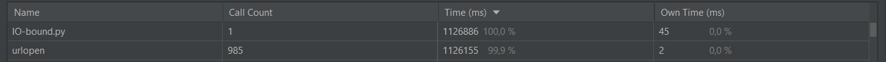
### Диспетчер задач
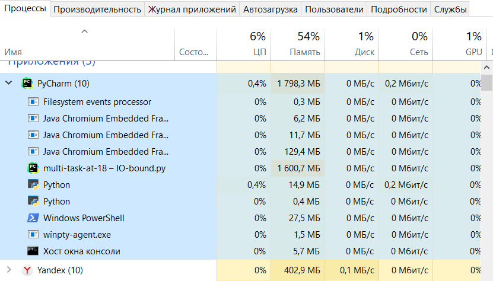
## Используя ThreadPoolExecutor:
## Воркер 5:
### Время
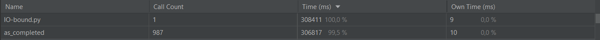
### Диспетчер
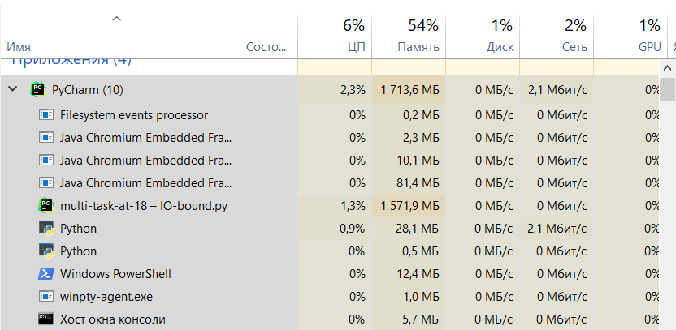
## Воркер 10:
### Время
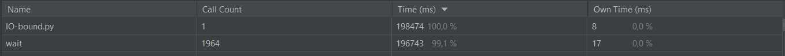
### Диспетчер
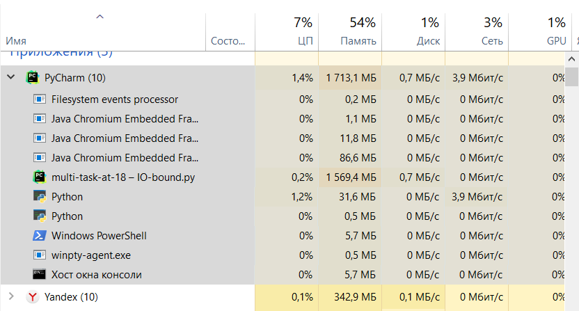
## Воркер 100:
### Время 
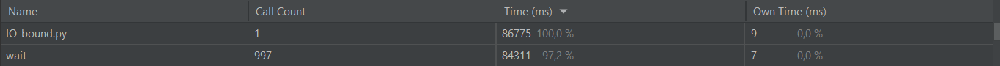
### Диспетчер
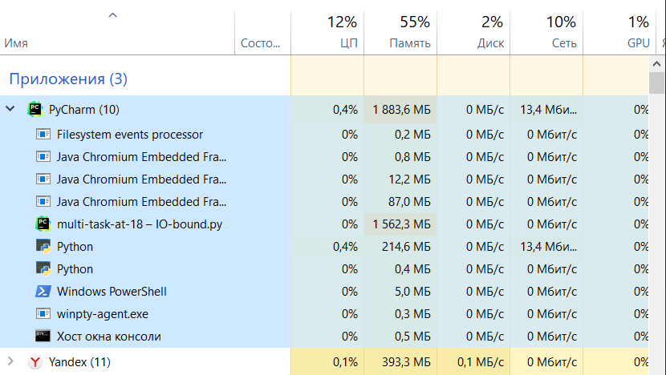
Загрузка памяти почти не отличается, загрузка ЦП совсем немного увеличивается. Но время выполнения существенно сокращается
# CPU-bound
Замер будет на поиске 5-и монет
## Скорость генерации на 1 ядре
### Время
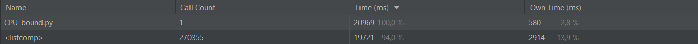
### Диспетчер
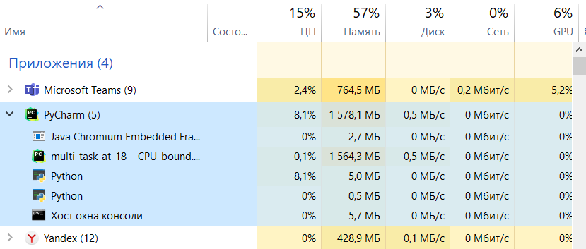
## Используя ProcessPoolExecutor:
## Воркер 2:
### Время
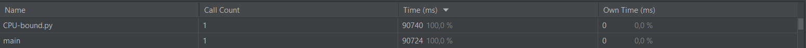
### Диспетчер
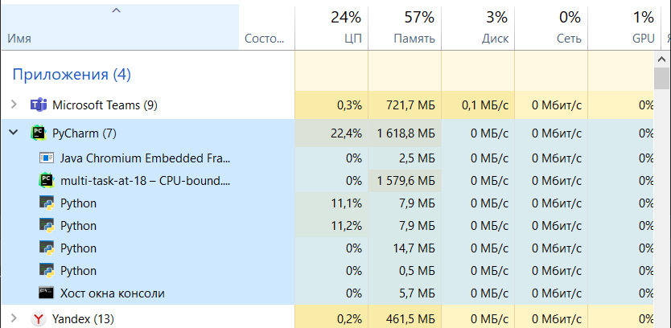
## Воркер 4:
### Время
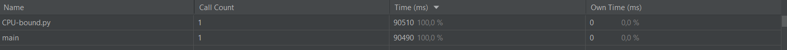
### Диспетчер
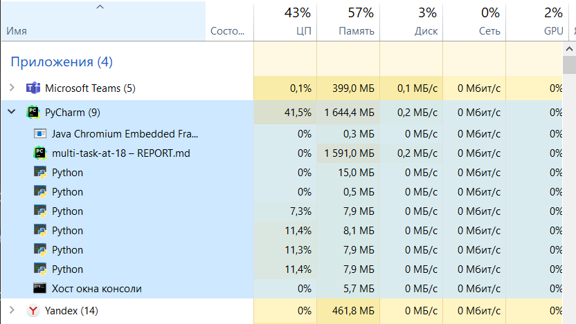
## Воркер 5:
### Время
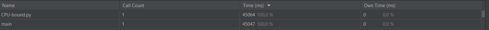
### Диспетчер
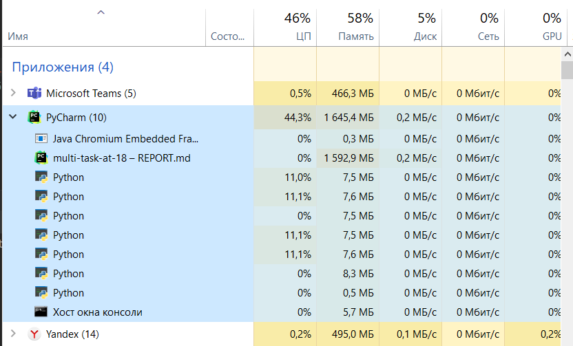
## Воркер 10:
### Время
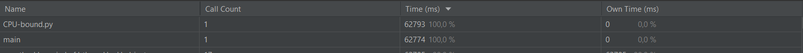
### Диспетчер
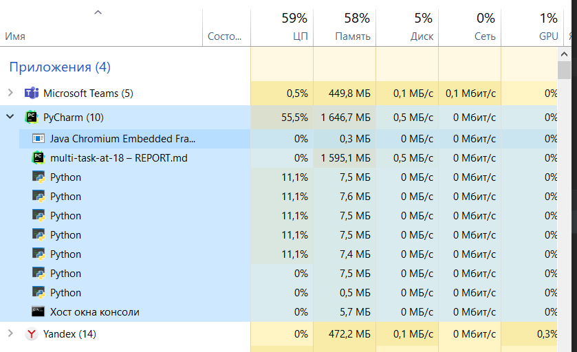
## Воркер 100:
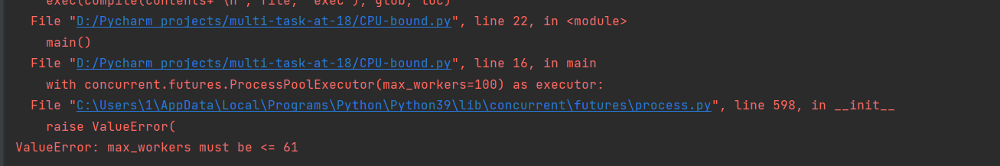
Сильно меняется загрузка процессора, время выполнения уменьшается с увеличением количества воркеров. Максимальное количество воркеров - 61 из-за особенностей ОС. 