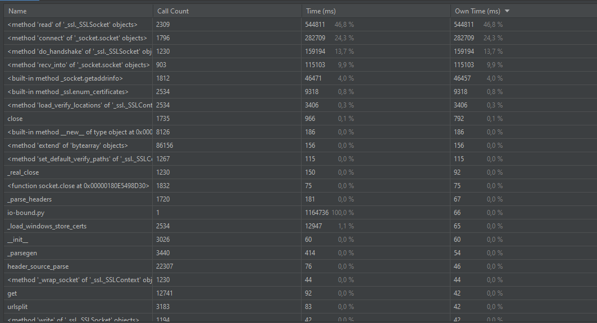
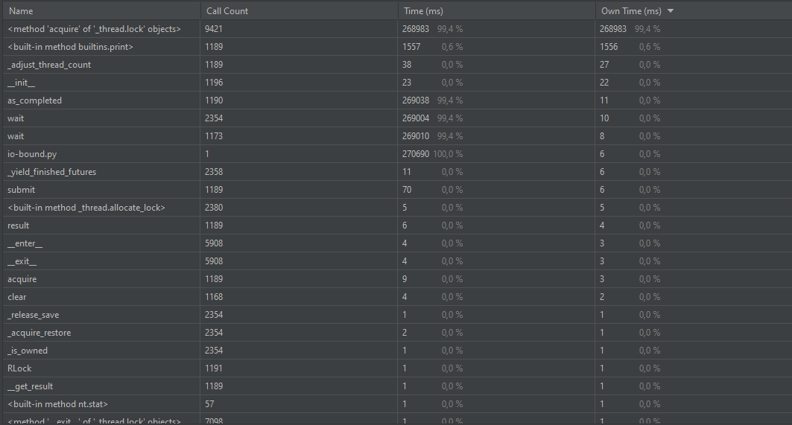
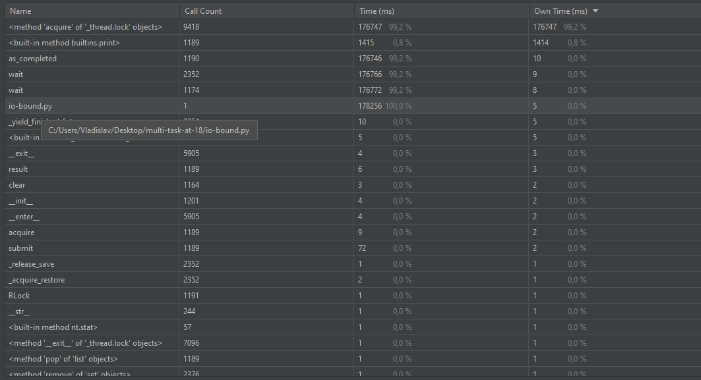
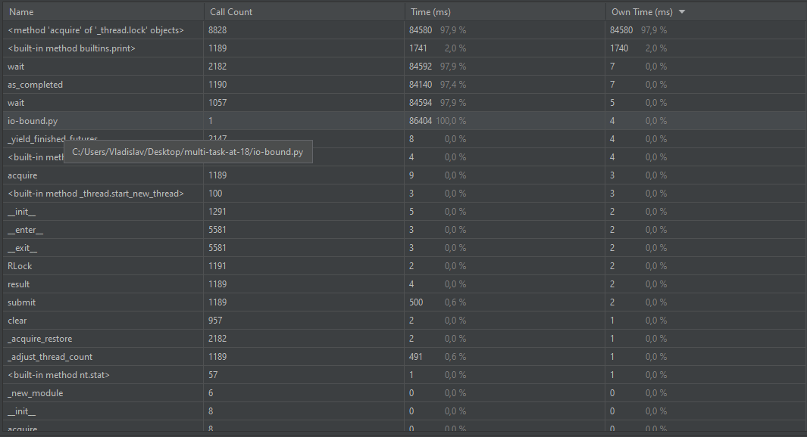

#Параллелизм и асинхронность

## IO-bound

Синхронно в 1 поток:

5 воркеров:

10 воркеров:

100 воркеров:

Количество задействованной памяти и нагрузка на ЦП почти 
не изменяется, так как из-за большого количества воркеров 
происходит быстрое взаимодействие с сетью