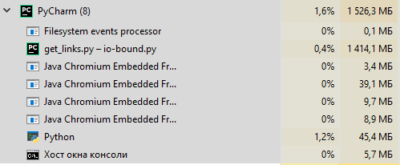
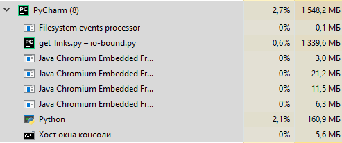
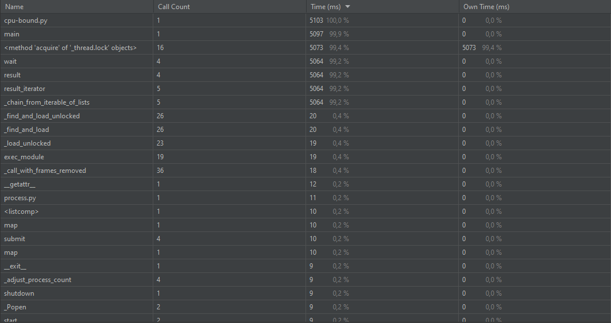
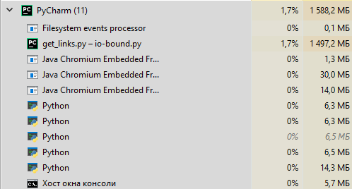

# Параллелизм и асинхронность

## IO-bound

Синхронно в 1 поток:

5 воркеров:

10 воркеров:

100 воркеров:

Количество задействованной памяти и нагрузка на ЦП почти 
не изменяется, так как из-за большого количества воркеров 
происходит быстрое взаимодействие с сетью.

## CPU-bound

Генерация на 1 ядре для 4 монет:

2 воркера для 4 монет:

4 воркера для 4 монет:

5 воркеров для 4 монет:

10 воркеров для 4 монет:

100 воркеров для 4 монет:
Будет выдавать ошибку, так как есть ограничение в 61 воркер

Протестировав программу пару раз, я пришел к выводу, 
что увеличение или уменьшение кол-ва воркеров никак
не влияет на конечное время работы программы. Загруженность ЦП
никак не мог нормально уловить, так как программа буквально
за считанные секунды выполняла работу. Такой разброс во времени
обусловлен рандомным нахождением нужных нам монет.
(Процессор 6 ядер 12 потоков)