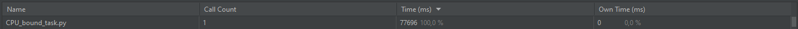
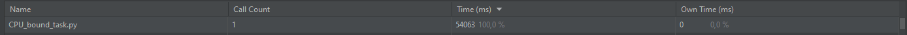
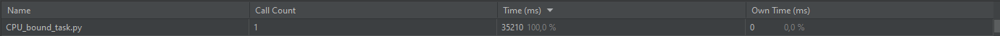
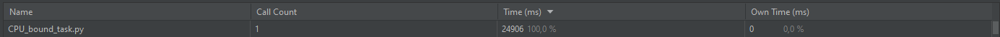

#Параллеизм и асинхронность

##Проверяем ссылки на страницах
Полученные ссылки извлекаем в файл `urls.txt`

Время синхронной проверки ссылок

Время работа 'IO-bound-task' c 5 воркерами:

Время работа 'IO-bound-task' c 10 воркерами:

Время работа 'IO-bound-task' c 100 воркерами:

Изменение количества воркеров существенно не влияет на загрузку ресурсов. Однако увеличение количества воркеров приводит к уменьшению времени работы программы и увелечению активности отправки и получения.

##CPU-bound. Генерируем монетки 
Генерация 4 монеток на 1 ядре:

Генерация 4 монеток c 2 воркерами:

Генерация 4 монеток с 4 воркерами:

Генерация 4 монеток с 5 воркерами:

Генерация 4 монеток с 10 воркерами:

Генерация 4 монеток с 61 воркерами:

Изменение количества воркеров влияет на загрузку ресурсов. Максимальное количество воркеров - 61 из-за ограничения ОС. Увеличение скорости генерации монет будет происходить, пока не будут использоваться все ресурсы процессора. 

