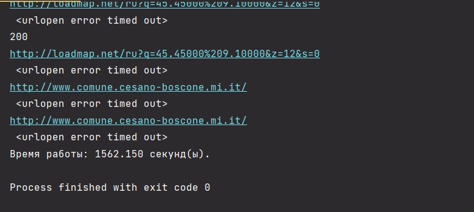
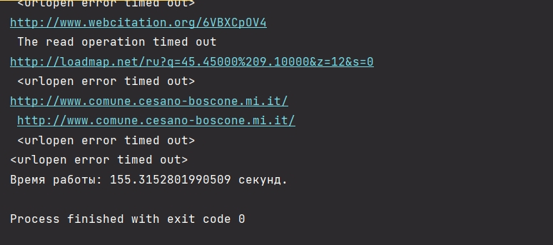
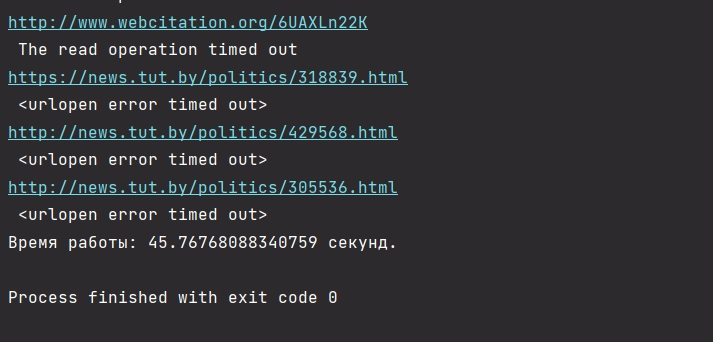
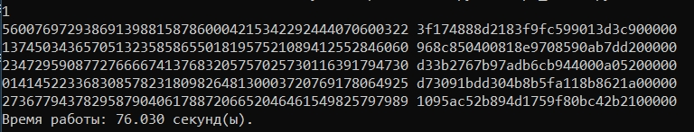
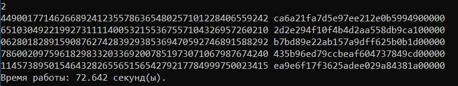
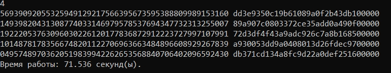
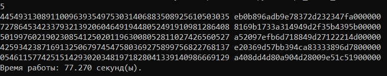
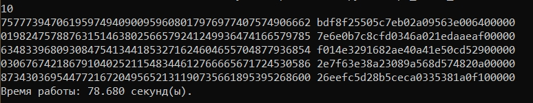
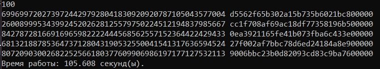

(Замерять стоило профилировщиком, но на результаты это, в целом, не влияет)
(Характеристики машины: 4 ядра, 8 потоков)

#IO
1) Всего со 100 страниц wiki удалось спарсить 1034 ссылки, все они лежат в файле [res.txt](res.txt). 

2) Замер скорости при синхронном опросе всех ссылок из [res.txt](res.txt).
* Скорость медленная, процессор почти не загружен, сеть используется не постоянно.

3) Замер скорости при использовании 5 процессов для опроса всех ссылок из [res.txt](res.txt).
* Скорость увеличилась практически в 5 раз по сравнения с замером без процессов, возросла нагрузка на процессор, использовано немного больше оперативной памяти, сеть практически всегда используется.(относительно предыдущего замера)

4) Замер скорости при использовании 10 процессов для опроса всех ссылок из [res.txt](res.txt).
* Скорость увеличилась практически в 10 раз по сравнения с замером без процессов, возросла нагрузка на процессор, использовано немного больше оперативной памяти, сеть практически всегда используется.(относительно предыдущего замера)

5) Замер скорости при использовании 100 процессов для опроса всех ссылок из [res.txt](res.txt).
* Скорость увеличилась практически в 33 раз по сравнения с замером без процессов, возросла нагрузка на процессор, использовано немного больше оперативной памяти, сеть практически всегда используется.(относительно предыдущего замера)

Вывод: 
* Прирост производительности зависит от мощности пк.
* До определенного момента он происходит практически линейно, но после того как достигается потолок самого слабого звена системы, линейный рост пропадает и каждый следующий процесс приносит все меньше убыстрений.

#CPU
Во всех примерах сеть не используется. Будем генерировать 5 монет.
(Тестирование не совсем корректно, т.к. во многом зависит от рандома сгенерированных монет.)

1) Замер скорости при использовании одного процесса.
* Скорость медленная, процессор мало загружен.

2) Замер скорости при использовании двух процессов.
* Скорость увеличилась на 5-10% по сравнения с замером без процессов, возросла нагрузка на процессор, использовано немного больше оперативной памяти.(относительно предыдущего замера)

3) Замер скорости при использовании четырех процессов.
* Скорость увеличилась на 7-15% по сравнения с замером без процессов, возросла нагрузка на процессор, использовано немного больше оперативной памяти.(относительно предыдущего замера)

4) Замер скорости при использовании пяти процессов.
* Скорость уменьшилась на 5-10% по сравнения с замером без процессов, нагрузка на процессор примерно равно нагрузке на прошлом этапе, использовано немного больше оперативной памяти.(относительно предыдущего замера)

5) Замер скорости при использовании пяти процессов.
* Скорость уменьшилась на 7-12% по сравнения с замером без процессов, нагрузка на процессор примерно равно нагрузке на прошлом этапе, использовано немного больше оперативной памяти.(относительно предыдущего замера)

6) Замер скорости при использовании пяти процессов.
* Скорость уменьшилась на 15-20% по сравнения с замером без процессов, нагрузка на процессор примерно равно нагрузке на прошлом этапе, использовано немного больше оперативной памяти.(относительно предыдущего замера)

Вывод: Для cpu задач увеличение процессов ускоряет выполнение только пока оно не сравняется с количеством физических ядер процессора, после того, как кол-во процессов опережает кол-во физ. ядер производительность начинает падать.