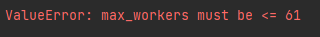

# Task-on-topic-No.-11-Multi
**my CPU: AMD A6-3410MX (4C/4T)*\
***В задании "CPU-bound" я уменьшил количество нулей в искомом md5-hash до 4, т.к. поиск 
на моем компьютере даже одного значения с 5-ю нулями слишком времязатратный*
____

## ThreadPoolExecutor

**Вывод**: от увеличения кол-ва воркеров увеличивались нагрузка на процессор, 
объём занимаемой оперативной памяти и нагрузка на сеть. Время работы сокращалось.

Время выполнения без использования ThreadPoolExecutor:

Время выполнения с использованием ThreadPoolExecutor:

ThreadPoolExecutor(max_workers=5):

ThreadPoolExecutor(max_workers=10):

ThreadPoolExecutor(max_workers=100):

## ProcessPoolExecutor

**Вывод**: от установки большего кол-ва воркеров, чем ядер процессора, нагрузка на процессор никак не изменилась 
и время выполнения практически не изменялось; а при установке кол-ва воркеров меньше чем ядер процессора 
время выполнения увеличилось.

Поиск 30 md5-hash без использования ProcessPoolExecutor:

Поиск 30 md5-hash с использованием ProcessPoolExecutor:

ProcessPoolExecutor(max_workers=2):

ProcessPoolExecutor(max_workers=10):

ProcessPoolExecutor(max_workers=100):

ProcessPoolExecutor(max_workers=61):

