# Pre-test info
#### Parsed wiki links count - 1561 ([here](res.txt))
#### CPU - 12 Core (24 Threads) 3.8GHz
#### RAM - 16 GB
#### Internet connection speed - 100 Mb/s
# IO-Bound
### Sync (1 thread)

> Task Manager
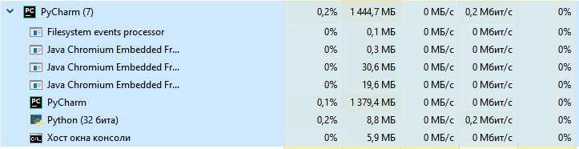
Time (profiler) - 31.76 mins
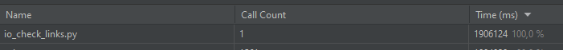

### ThreadPoolExecutor
#### 5 workers

> Task Manager
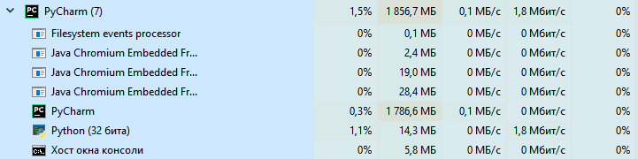
Time (profiler) - 6.81 mins
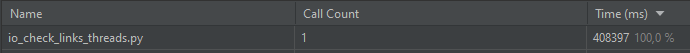

#### 10 workers

> Task Manager
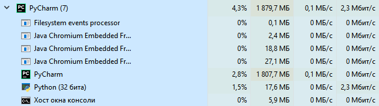
Time (profiler) - 3.37 mins
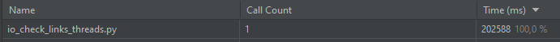

#### 100 workers

> Task Manager
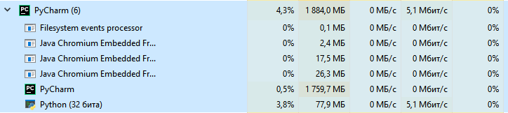
Time (profiler) - 1.5 min
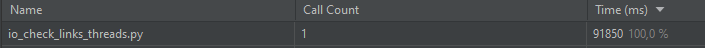

### Conclusion

* Скорость выполнения IO-Bound задачи возрастает с увеличением количества потоков исполнения
* На больших количествах потоков, скорость выполнения может возрастать нелинейно

# CPU-Bound
Number of required coins: 4
### 1 Core

> Task Manager
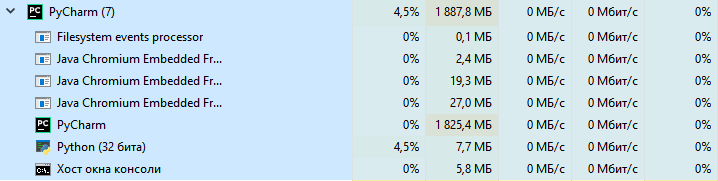
Time (profiler) - 3.67 mins
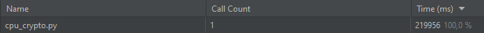

### ProcessPoolExecutor
#### 2 workers

> Task Manager
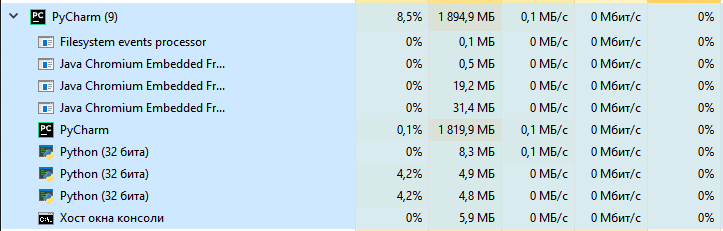
Time (profiler) - 0.7 min (42.23 sec)
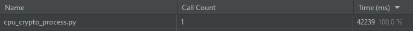

#### 4 workers

> Task Manager
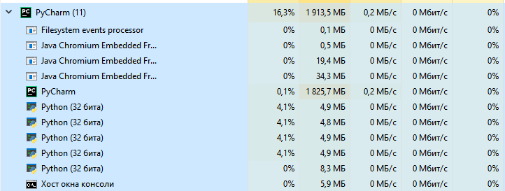
Time (profiler) - 0.85 min (51 sec)
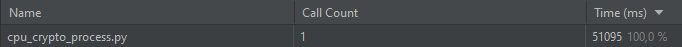

#### 5 workers

> Task Manager
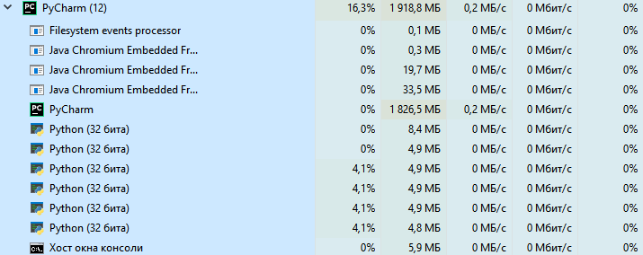
Time (profiler) - 0.66 min (39.6 sec)
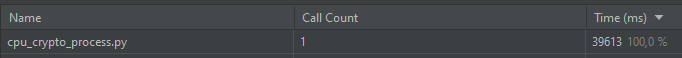

#### 10 workers

>Task Manager
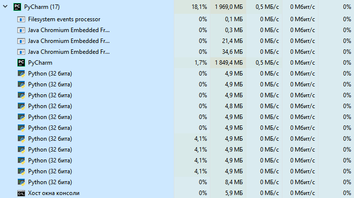
Time (profiler) - 1.5 min (89 sec)
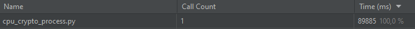

- Время сильно увеличилось из-за долгого нахождения одного койна (просто не везло)

#### 100 workers

> 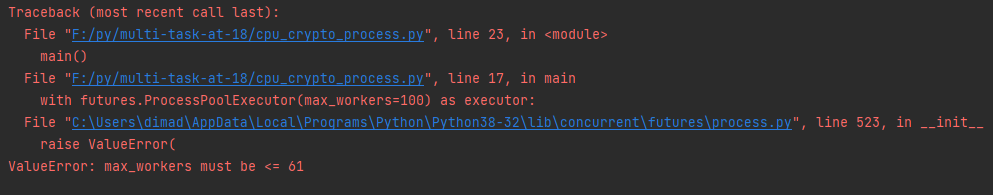

### Conclusion
* Скорость выполнения CPU-Bound задач не возрастает за счёт увеличения количества ядер
